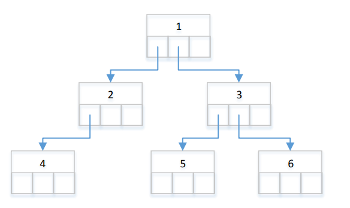
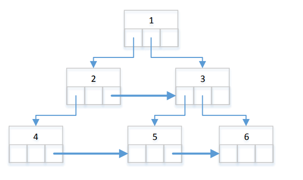

## BinaryTreeTask

You are given a binary tree:
```
public class Node
{
  public int val; // value of node
  public Node left; // left subtree
  public Node right; // right subtree
  public Node level; // level pointer (node “to the right”)
}
```
Write a function that will link all the nodes at the same level in a tree

## Example:
If you are given the tree:
<p align="center">
  
</p>

your implementation of linkRightNeighbour function should create the links (i.e. pointers) illustrated at image
below:
<p align="center">
  
</p>
